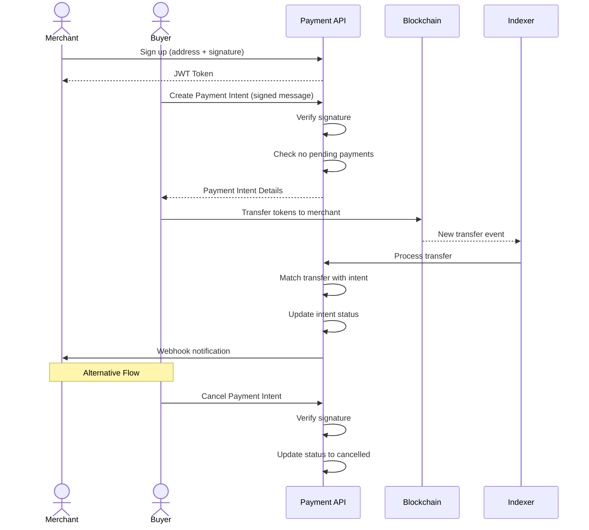

## PayItOnChain Backend Example



### Setup

Install [Orbstack](https://orbstack.dev/). Don't use plain docker.
```bash
docker compose up --build
```
This will get the Redis and Postgres containers up and running.

```bash
npx prisma generate
npx prisma migrate deploy
```
Start indexer.

```bash
pnpm run dev
```

Start server

```bash
pnpm run server:dev
```

Start workers

```bash
pnpm run worker:dev
```


#### Components

- Anvil local blockchain node
- [ponder.sh](https://ponder.sh) indexing service
- PostgresDb
- [Fastify](https://fastify.dev) server


