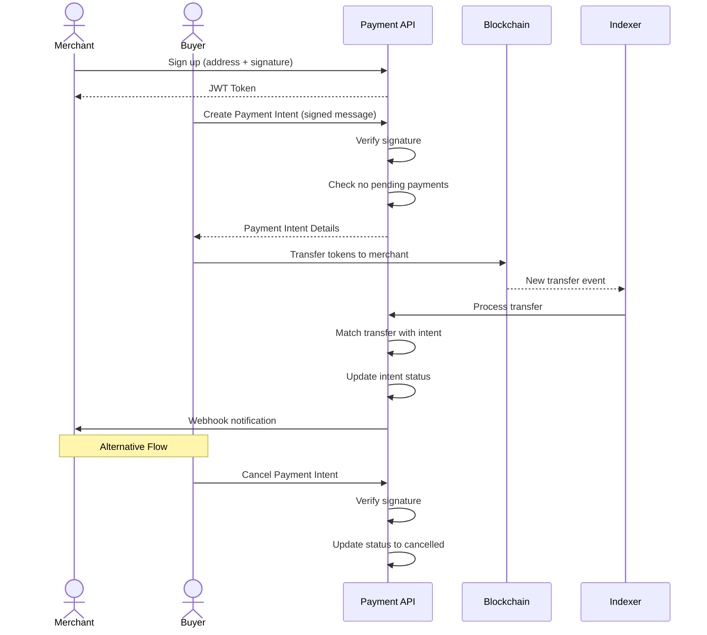

# What is PayItOnChain? [WIP - Actively developing]

PayItOnChain is a self-hosted payment processing service that enables merchants to accept blockchain payments for off-chain products and services. Think of it as a "Stripe for blockchain" that you can run yourself.

## Core Features

- **On-chain payments for off-chain items**: Accept cryptocurrency payments for physical goods, digital downloads, services, or subscriptions
- **Multi-chain support**: Process payments across multiple EVM-compatible blockchains (Ethereum, Polygon, etc.)
- **Merchant dashboard**: Track payments, verify transactions, and manage your store
- **Webhook notifications**: Get real-time updates when payments are received
- **Payment intent system**: Create and track payment intents similar to traditional payment processors
- **Self-hosted**: Maintain full control of your payment infrastructure without relying on third-party services

## How It Works

1. **Merchant registration**: Create a merchant account by signing a message with your wallet
2. **Payment intent creation**: Generate payment details for customers with verification via signed messages
3. **On-chain settlement**: Customers send tokens directly to your wallet address
4. **Automatic verification**: The indexer detects and verifies blockchain transactions
5. **Webhook notifications**: Your application receives notifications when payments are confirmed

PayItOnChain bridges the gap between blockchain payments and traditional e-commerce, allowing merchants to accept cryptocurrency payments while maintaining the same level of control and visibility as traditional payment processors.

## PayItOnChain Backend Example



### Setup

Install [Orbstack](https://orbstack.dev/). Don't use plain docker.
```bash
docker compose up --build
```
This will get the Redis and Postgres containers up and running.

```bash
npx prisma generate
npx prisma migrate deploy
```
Start indexer.

```bash
pnpm run dev
```

Start server

```bash
pnpm run server:dev
```

Start workers

```bash
pnpm run worker:dev
```

# Payment API Documentation

## Merchant Account Creation

1. Get a nonce:
```bash
GET /nonce
```

2. Create merchant account:
```bash
POST /merchants
Content-Type: application/json

{
  "name": "Merchant Name",
  "address": "0x...", // Merchant wallet address
  "webhookUrl": "https://...",
  "nonce": "received-nonce",
  "signature": "0x...", // Sign message: "Register merchant account for {address} with name {name} and unique key: {nonce}"
  "chainIds": [1, 137] // Supported chain IDs
}

Response: {
  "merchant": {...},
  "token": "jwt-token" // Store this for authentication
}
```

## Payment Flow

1. Create payment intent:
```bash
POST /payment-intents
Content-Type: application/json

{
  "from": "0x...", // Buyer address
  "to": "0x...", // Merchant address
  "amount": 1000000, // Amount in wei
  "token": "0x...", // Token contract address
  "chainId": 1,
  "extId": "order-123",
  "merchantId": "merchant-uuid",
  "signature": "0x..." // Sign message: "Create payment intent: to={to} amount={amount} token={token} chainId={chainId} extId={extId}"
}
```

2. Cancel payment (if needed):
```bash
POST /payment-intents/:id/cancel
Content-Type: application/json

{
  "from": "0x...", // Must match original buyer
  "signature": "0x..." // Sign message: "Cancel payment intent {id}"
}
```

## View Payments

```bash
GET /payments
Authorization: Bearer jwt-token

Response: {
  "payments": [...]
}
```

Key Notes:
- All signatures must be from the corresponding wallet addresses
- Merchants can only have one pending payment per buyer
- Webhook URL must include "http"
- JWT token required for authenticated endpoints


#### Components

- Anvil local blockchain node
- [ponder.sh](https://ponder.sh) indexing service
- PostgresDb
- [Fastify](https://fastify.dev) server


